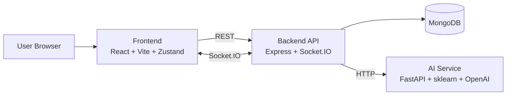
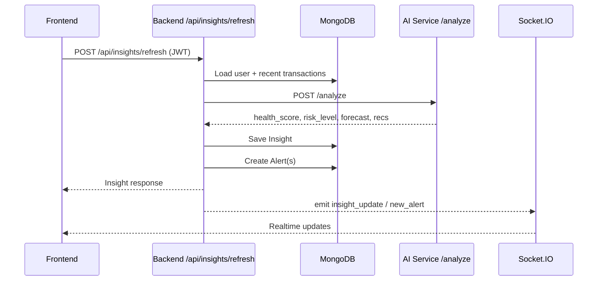
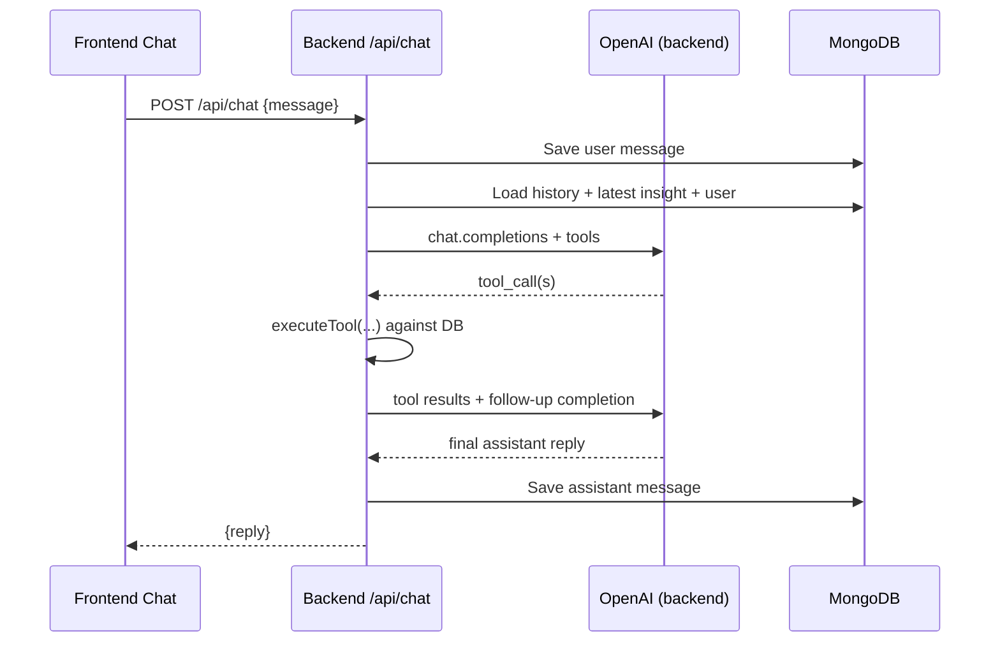

# PROJECT_DOCUMENTATION.md

## 1. System Architecture

### 1.1 High-Level Topology

### 1.2 Insight Refresh Request Flow

### 1.3 Chat Tool-Execution Flow

## 2. Frontend Deep Dive

### 2.1 Structure

- Entry: `frontend/src/main.tsx`
- Shell + routing: `frontend/src/App.tsx`
- Global state: `frontend/src/store/useStore.ts`
- API client + mocks: `frontend/src/lib/api.ts`
- Socket client: `frontend/src/lib/socket.ts`

### 2.2 Pages

- `LoginPage.tsx`: auth + demo login + preload insights
- `LandingPage.tsx`: authenticated launch hub (`/home`)
- `DashboardPage.tsx`: health/risk/forecast/category/simulation
- `TransactionsPage.tsx`: summary + list + anomalies
- `AlertsPage.tsx`: unread/read management
- `ChatPage.tsx`: full-height AI assistant container

### 2.3 State Management (Zustand)

`useStore` stores:

- Auth: `user`, `token`
- Domain: `insight`, `transactions`, `alerts`, `unreadCount`
- UI flags: `isLoading`, `isRefreshing`
- Actions: `set*` setters + `logout()`

Design note: token persistence is localStorage-based (`ss_token`).

### 2.4 API Layer

`lib/api.ts` has:

- strict TypeScript interfaces for all main entities
- a `USE_MOCK` switch for backend-independent demo mode
- axios interceptors for JWT header + 401 logout handling

### 2.5 Realtime UI

- App bootstrap registers socket after successful `/api/auth/me`
- Subscribes to:
  - `new_alert`: prepends alert and increments unread count
  - `insight_update`: updates latest insight in store

## 3. Backend Deep Dive

### 3.1 Runtime

- Node.js + Express server: `backend/server.js`
- MongoDB via Mongoose
- Socket.IO server mounted on same HTTP server

### 3.2 Middleware

- `middleware/auth.js` validates `Bearer <JWT>` and injects `req.user`

### 3.3 Routes

- `routes/auth.js`
  - `POST /register`
  - `POST /login`
  - `GET /me`
- `routes/transactions.js`
  - list/filter/paginate transactions
  - monthly category summary aggregation
  - anomalies list
  - create transaction with AI categorization
- `routes/insights.js`
  - fetch latest insight
  - refresh insight via AI service
  - forecast retrieval
- `routes/alerts.js`
  - get alerts + unread count
  - mark one or all read
- `routes/chat.js`
  - tool-augmented chat orchestration
  - chat history list/clear

### 3.4 Services

- `services/aiService.js`: backend-to-ai-service HTTP client wrappers
- `services/socketService.js`: per-user socket registration + emits

## 4. AI/LLM Integration

### 4.1 AI Service Responsibilities

`ai-service/main.py` exposes:

- `/analyze`
- `/categorize`
- `/categorize-batch`
- `/forecast`
- `/anomalies`
- `/nudge-message`
- `/financial-summary`
- `/health`

### 4.2 Algorithmic Components

- Health score heuristic (`compute_health_score`)
- Pace-aware overspend projection
- Category breach detection
- 30-day forecast generation with controlled variance
- IsolationForest anomaly detection on amount/time/category features

### 4.3 OpenAI Usage

- Optional (fails over gracefully when no key)
- Used for:
  - categorization improvements
  - nudge wording
  - compact financial summary
- Backend chat route separately uses OpenAI with function tools.

## 5. Data Models

### 5.1 User (`models/User.js`)

- Identity + auth (`name`, `email`, `password` hash)
- Budget config (`income`, `monthly_budget`, `category_budgets` map)
- `currency` default `INR`

### 5.2 Transaction (`models/Transaction.js`)

- Financial events per user
- Category/channel metadata
- Anomaly flags + score

### 5.3 Insight (`models/Insight.js`)

- Point-in-time AI analysis snapshot
- score/risk/recommendations/forecast/category summaries
- generated timestamp

### 5.4 Alert (`models/Alert.js`)

- Severity-typed notifications
- read state + trigger metadata

### 5.5 ChatMessage (`models/ChatMessage.js`)

- per-user assistant/user dialogue history

## 6. Realtime System

### 6.1 Event Contract

Backend emits:

- `new_alert` with alert payload
- `insight_update` with latest insight payload

### 6.2 Registration Flow

- Client emits `register` with userId after auth bootstrap
- Backend maps `userId -> socketId`

### 6.3 Current Constraint

- Single socket per user is tracked (`Map<userId, socketId>`)
- Last active registration wins (multi-tab/device fanout not yet implemented)

## 7. Error Handling Strategy

### Frontend

- API-level failures show inline retry cards
- Chat history/load errors have dedicated retry UI
- 401 interceptor clears token and redirects to login

### Backend

- Defensive validation with 400/401/404 where relevant
- Generic 500 responses for uncaught failures
- Chat route maps some OpenAI failures to user-friendly messages

### AI Service

- Endpoint-level try/except fallback responses to avoid demo-breaking crashes

## 8. Loading + Empty States Strategy

- Dashboard skeleton for initial insight load
- Clear `No Analysis Yet` state for missing insights (`404`)
- Transaction and alert skeletons before data hydration
- Chat empty state with starter prompts when no history exists
- Chat typing indicator + optimistic message updates

## 9. Design Decisions

- Separate AI microservice to isolate ML/LLM dependencies from Node runtime
- Keep backend as orchestration boundary for auth, persistence, and realtime fanout
- Use Zustand for low-friction state management in a hackathon-fast codebase
- Keep `USE_MOCK` mode for frontend parallel development and demo resilience
- Use tool-enabled chat to reduce hallucination risk for data questions

## 10. Scalability Considerations

- Move insight refresh to queued jobs (BullMQ/SQS) for higher throughput
- Add Redis pub/sub or message bus for Socket.IO horizontal scaling
- Store multiple socket IDs per user for multi-device consistency
- Add rate-limiting + per-route caching for expensive summaries
- Introduce API versioning and contract tests for service boundaries
- Add observability (structured logs, traces, metrics)

## 11. Known Limitations

- No automated integration/e2e test suite yet
- Single-socket mapping per user (last session wins)
- Chat backend currently uses direct OpenAI calls (no circuit-breaker layer)
- Secret management is file/env based (no cloud secret manager integration)
- Mock and real data paths coexist in frontend API module (trade-off for speed)
