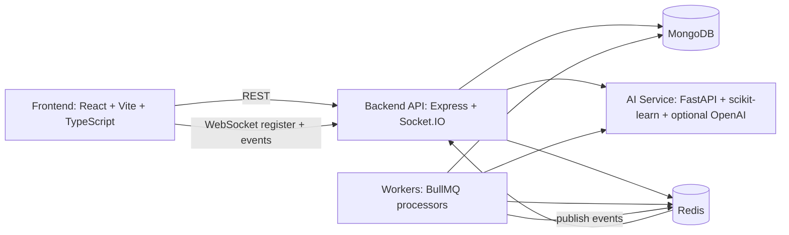

# Finexa

Finexa is an AI-powered personal finance safety platform focused on one core outcome: helping users avoid month-end financial surprises.

It combines a modern React client, a Node.js API, a Python AI service, Redis/BullMQ workers, and MongoDB persistence into a single full-stack system that supports:

- risk-aware spending analysis
- anomaly detection
- proactive alerts
- savings goal planning
- subscription intelligence
- conversational financial coaching (Fin Guardian)

## Who This Is For

- Recruiters and hiring managers: this repository demonstrates production-style architecture decisions across frontend, backend, ML service, async workers, and CI/CD.
- Developers: this repository is runnable locally and in Docker with clear service boundaries and realistic domain modeling.
- Judges and demo evaluators: this repository has end-to-end user journeys, visible AI value, and real-time behaviors.
- Investors and product stakeholders: this repository demonstrates a strong foundation for a consumer fintech intelligence product.

## What Is Implemented Today

- JWT auth and profile updates
- transaction ingestion, summary, and anomaly surfacing
- AI insight generation with health score, risk factors, category breaches, and forecast
- alert management (read/unread, mark all)
- tool-enabled chat assistant (Fin Guardian) with deterministic fallback paths
- goals engine with feasibility scoring, contributions, and projections
- subscription detection and management (confirm/dismiss/manual add)
- mock Account Aggregator and UPI connector flows
- asynchronous sync/insight/alert/monthly-plan workers via BullMQ
- Socket.IO realtime updates for alerts and insights

## Architecture At A Glance



## Quick Start (Local Development)

### Prerequisites

- Node.js 20+
- Python 3.11+
- MongoDB
- Redis

### 1) Install dependencies

```bash
cd backend && npm install
cd ../frontend && npm install
cd ../ai-service && python -m venv venv && source venv/bin/activate && pip install -r requirements.txt
cd ..
```

### 2) Configure environment files

- backend API: create `backend/.env` (can be based on root `.env.development` values)
- frontend: create `frontend/.env` from `frontend/.env.example`
- AI service: create `ai-service/.env` with optional `OPENAI_API_KEY`

Minimum backend variables required by schema validation:

- `NODE_ENV`
- `PORT`
- `MONGODB_URI`
- `REDIS_URL`
- `JWT_SECRET` (minimum 64 chars)
- `AI_SERVICE_URL`
- `CLIENT_URL`

### 3) Seed demo data

```bash
cd backend
npm run seed
```

Default seeded login:

- `demo@smartspend.ai`
- `demo1234`

### 4) Run services

Terminal 1 (AI service):

```bash
cd ai-service
source venv/bin/activate
uvicorn main:app --reload --port 8000
```

Terminal 2 (backend API):

```bash
cd backend
npm run dev
```

Terminal 3 (frontend):

```bash
cd frontend
npm run dev
```

Terminal 4 (recommended for async features):

```bash
cd backend
npm run workers
```

Without workers, core API flows still run, but queued sync jobs and scheduled proactive tasks will be limited.

## Quick Start (Docker Compose)

From repository root:

```bash
docker compose -f docker/docker-compose.yml up --build
```

Optional reseed inside containers:

```bash
docker exec finexa-backend node scripts/seedDB.js
```

Services:

- frontend: http://localhost:5173
- backend: http://localhost:5000
- ai-service: http://localhost:8000

## Demo Journey

1. Login with demo credentials.
2. Open Dashboard and run Refresh Analysis.
3. Review health score, risk factors, forecast, category breakdown, and simulator.
4. Visit Transactions and inspect anomaly-tab behavior.
5. Visit Accounts and run Account Aggregator or UPI simulation flow.
6. Visit Subscriptions and Goals for actionable planning surfaces.
7. Open Fin Guardian chat and ask data-driven questions.

## API Surface (High-Level)

Auth:

- `POST /api/auth/register`
- `POST /api/auth/login`
- `GET /api/auth/me`
- `PATCH /api/auth/me`

Transactions:

- `GET /api/transactions`
- `GET /api/transactions/summary`
- `GET /api/transactions/anomalies`
- `POST /api/transactions`

Insights:

- `GET /api/insights`
- `POST /api/insights/refresh`
- `GET /api/insights/forecast`
- `GET /api/insights/monthly-plan`

Alerts:

- `GET /api/alerts`
- `PATCH /api/alerts/read-all`
- `PATCH /api/alerts/:id/read`

Chat:

- `POST /api/chat`
- `GET /api/chat/history`
- `DELETE /api/chat/history`

Goals:

- `GET /api/goals`
- `POST /api/goals`
- `PATCH /api/goals/:id`
- `DELETE /api/goals/:id`
- `GET /api/goals/:id/projection`
- `POST /api/goals/:id/contribute`

Subscriptions:

- `GET /api/subscriptions`
- `GET /api/subscriptions/total`
- `POST /api/subscriptions`
- `POST /api/subscriptions/:id/confirm`
- `POST /api/subscriptions/:id/dismiss`

Data sources + sync:

- `GET /api/datasources`
- `POST /api/datasources/connect`
- `DELETE /api/datasources/:id`
- `POST /api/datasources/aa/initiate-consent`
- `GET /api/datasources/aa/consent-status/:id`
- `POST /api/datasources/aa/fetch-data`
- `GET /api/datasources/upi/connect`
- `POST /api/datasources/upi/webhook`
- `POST /api/sync/trigger/:sourceId`
- `GET /api/sync/status/:jobId`
- `GET /api/sync/history`

Health:

- `GET /health` (backend)
- `GET /health` (ai-service)

## Testing And CI

Run tests locally:

```bash
cd backend && npm test
cd ../frontend && npm run test
cd ../ai-service && source venv/bin/activate && pytest
```

GitHub Actions workflows in `.github/workflows` run:

- backend tests
- frontend tests
- ai-service tests
- webhook-based deploy triggers for Railway (backend/ai-service) and Vercel (frontend)

## Deployment Notes

- `railway.toml` defines backend and ai-service service roots/start commands.
- `vercel.json` builds frontend via Vite output at `frontend/dist`.
- Root `main.py` is an ASGI shim so `uvicorn main:app` from repo root maps to `ai-service/main.py`.

## Honest Gaps And Risks

- Account Aggregator and UPI connectors are currently simulated connectors, not production bank integrations.
- Socket user mapping currently tracks one socket id per user id in memory; multi-tab/device fanout semantics are basic.
- AI service CORS is currently permissive (`allow_origins=["*"]`) and should be restricted before production.
- Test coverage is meaningful but not full-system; end-to-end and load tests are still needed.
- Secrets hygiene remains critical: ensure no real credentials are committed, and rotate any key ever exposed outside a secure secret manager.

## Repository Map

- `frontend/`: React app, UI components, pages, state, API client
- `backend/`: Express API, domain models, middleware, services, workers, queues
- `ai-service/`: FastAPI ML/AI endpoints
- `docker/`: compose and container definitions
- `docs/`: architecture, API, deployment, contributing, security
- `docs/PROJECT_MASTER_DOCUMENTATION.md`: deep technical source-of-truth handbook

## License

MIT. See `LICENSE`.
