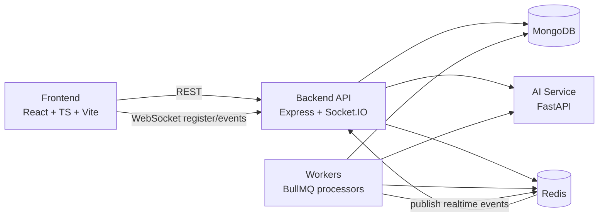
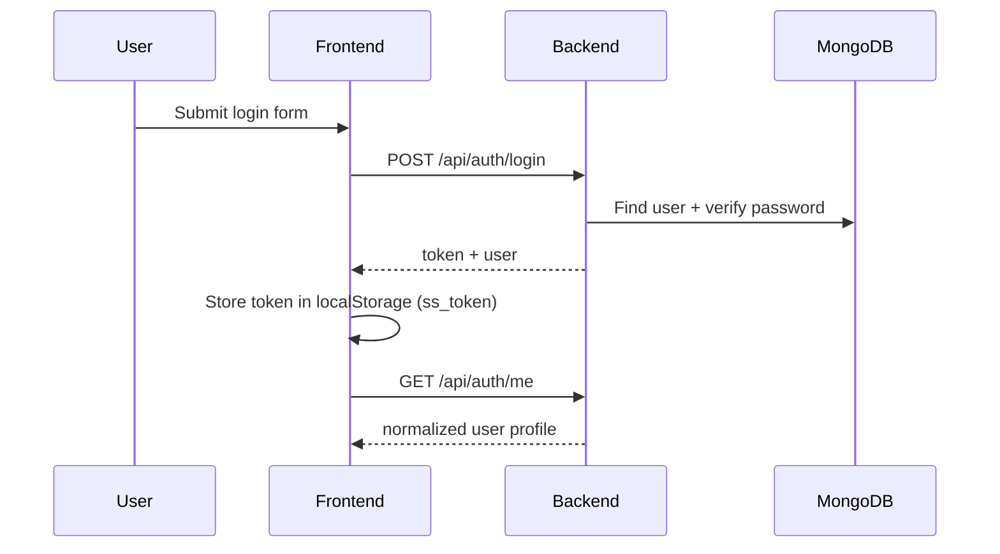
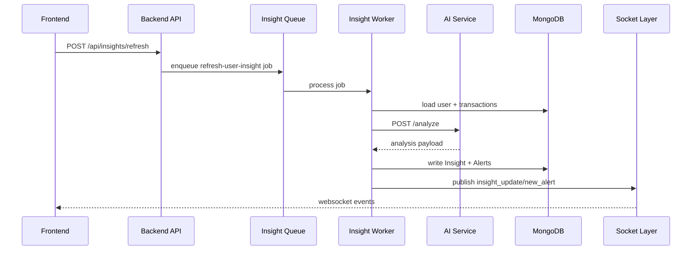
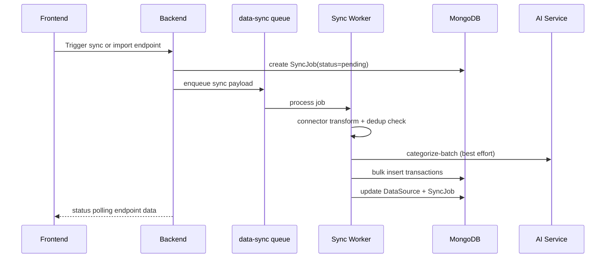

# PROJECT DOCUMENTATION

## 1. Purpose And Source-Of-Truth Contract

This document is the technical source-of-truth for the implemented system in this repository.

It is written from direct code inspection across:

- frontend application code
- backend API, models, services, middleware, queues, and workers
- AI service endpoints and tests
- deployment and container artifacts
- CI/CD workflows

This document intentionally prefers implementation truth over planning docs.

## 2. Audit Method And Confidence

### 2.1 Method Used

- read and map all top-level markdown docs
- inspect code paths for all major modules (frontend, backend, ai-service)
- inspect routes, models, services, and worker orchestration
- inspect docker, compose, railway, and vercel deployment config
- inspect test suites and CI workflows

### 2.2 Confidence Levels

- High confidence: route inventory, data models, queue wiring, endpoint behavior, env contracts, and test coverage outlines
- Medium confidence: UX details that depend on runtime data shape and integration environments
- Lower confidence (explicit assumptions): production infra topology beyond files in this repository

## 3. Executive System Summary

Finexa is a full-stack AI-assisted personal finance platform designed for financial safety monitoring.

It provides:

- account and transaction intake (including mock connector flows)
- monthly spending intelligence and risk scoring
- anomaly detection and proactive alerts
- goal feasibility and projection workflows
- recurring subscription detection and management
- a conversational assistant (Fin Guardian) that can call data tools before responding

Core architecture is split into:

- Frontend SPA: React + TypeScript + Vite
- Backend API: Node.js + Express + MongoDB + Redis + Socket.IO + BullMQ
- AI Service: FastAPI + scikit-learn + optional OpenAI augmentation

## 4. Product Capability Matrix (Implemented)

| Capability                                      | Status      | Notes                                                             |
| ----------------------------------------------- | ----------- | ----------------------------------------------------------------- |
| Auth (register/login/me/update profile)         | Implemented | JWT-based, profile budget update supported                        |
| Transaction listing + summary + anomaly list    | Implemented | Category/date filters and anomaly endpoint available              |
| Manual transaction creation with categorization | Implemented | Backend requests AI categorization and falls back safely          |
| Insight generation and refresh                  | Implemented | Sync path and queued refresh path both supported                  |
| Forecast rendering                              | Implemented | 30-day style projection generated by AI service                   |
| Alerts feed with read states                    | Implemented | Single mark-read and mark-all-read both available                 |
| Realtime insight/alert pushes                   | Implemented | Socket.IO + Redis pub/sub fanout                                  |
| Fin Guardian chat with tool-calling             | Implemented | Tool catalog includes spend, risk, forecast, goals, subscriptions |
| Semantic memory retrieval in chat               | Implemented | Embedding-backed memory store + retrieval with fallback vector    |
| Goals create/update/contribute/projection       | Implemented | Feasibility score and monthly contribution math included          |
| Subscription auto-detection and triage          | Implemented | Confirm/dismiss/manual add supported                              |
| Data source management                          | Implemented | Seed, account aggregator mock, UPI mock connectors                |
| Sync jobs and status polling                    | Implemented | BullMQ queue + SyncJob model and status endpoint                  |
| Proactive alert scheduling                      | Implemented | Worker jobs scheduled periodically                                |
| Monthly plan generation                         | Implemented | Monthly plan worker and retrieval endpoint                        |
| CI tests for all three services                 | Implemented | GitHub Actions workflow present                                   |

## 5. High-Level Architecture

## 6. Runtime Flows

### 6.1 Auth And Session Flow

### 6.2 Insight Refresh Flow

### 6.3 Data Sync Flow (AA / UPI)

## 7. Frontend Architecture

### 7.1 Stack

- React 19
- TypeScript
- Vite
- Zustand
- React Router
- Axios
- Socket.IO client
- Recharts
- Framer Motion
- Tailwind CSS

### 7.2 App Shell And Routing

Implemented pages:

- /login
- /home (landing hub)
- /dashboard
- /transactions
- /alerts
- /chat
- /goals
- /subscriptions
- /accounts

Protected routing is token-gated with redirect to /login when no token exists.

### 7.3 State Management

Global state via Zustand holds:

- auth token + user profile
- current insight
- transactions
- alerts + unread count
- loading/refresh flags

Logout clears token and state and hard-redirects to /login.

### 7.4 API Client Strategy

- single Axios instance with `Authorization: Bearer <token>` interceptor
- global 401 interceptor clears token and redirects to /login
- typed response models for major domains
- mock-mode branch exists (`USE_MOCK`) for frontend-only demo behavior

### 7.5 Realtime UX

Frontend opens Socket.IO connection and emits a register event with user id.

Realtime events consumed:

- new_alert
- insight_update

Alert events update store and trigger toast notifications.

### 7.6 Feature Pages

- Dashboard: health/risk/forecast/category widgets, scenario simulator, profile budget update, source sync metadata
- Transactions: filters, anomalies tab, pagination/load-more behavior
- Alerts: severity feed, mark-read UX
- Chat: history load, optimistic send, typing indicator, retry, clear history
- Goals: create/edit/delete/contribute/projection workflows
- Subscriptions: detected vs confirmed tabs, manual add/confirm/dismiss
- Accounts: AA consent simulation, UPI connect simulation, sync status UX, source cards

## 8. Backend Architecture

### 8.1 Stack

- Node.js
- Express 5
- Mongoose
- JWT
- Redis (cache, pub/sub, rate limiter store)
- BullMQ
- Socket.IO
- Pino logging

### 8.2 Startup And Security

Boot sequence includes:

- environment schema validation via Zod
- request logging via pino-http
- Helmet security headers and CSP
- CORS allowlist from configured origins
- recursive payload sanitizer against dangerous keys
- HPP middleware
- global API rate limit middleware

### 8.3 Route Inventory

Auth:

- POST /api/auth/register
- POST /api/auth/login
- GET /api/auth/me
- PATCH /api/auth/me

Transactions:

- GET /api/transactions
- GET /api/transactions/summary
- GET /api/transactions/anomalies
- POST /api/transactions

Insights:

- GET /api/insights
- POST /api/insights/refresh
- GET /api/insights/forecast
- GET /api/insights/monthly-plan

Alerts:

- GET /api/alerts
- PATCH /api/alerts/read-all
- PATCH /api/alerts/:id/read

Chat:

- POST /api/chat
- GET /api/chat/history
- DELETE /api/chat/history

Goals:

- GET /api/goals
- POST /api/goals
- PATCH /api/goals/:id
- DELETE /api/goals/:id
- GET /api/goals/:id/projection
- POST /api/goals/:id/contribute

Subscriptions:

- GET /api/subscriptions
- GET /api/subscriptions/total
- POST /api/subscriptions
- POST /api/subscriptions/:id/confirm
- POST /api/subscriptions/:id/dismiss

Data Sources:

- GET /api/datasources
- POST /api/datasources/connect
- DELETE /api/datasources/:id
- POST /api/datasources/aa/initiate-consent
- GET /api/datasources/aa/consent-status/:id
- POST /api/datasources/aa/fetch-data
- GET /api/datasources/upi/connect
- POST /api/datasources/upi/webhook

Sync:

- POST /api/sync/trigger/:sourceId
- GET /api/sync/status/:jobId
- GET /api/sync/history

Health:

- GET /health

### 8.4 Chat Tooling Design

Backend chat route defines multiple callable tools, including:

- get_spending_summary
- get_balance_forecast
- get_risk_score
- get_anomalies
- simulate_scenario
- get_monthly_comparison
- get_top_merchants
- get_goals_status
- get_subscriptions_summary

Behavior:

- for data-like prompts, OpenAI tool_choice is forced to required
- tool outputs are fed back to model for final response
- if OpenAI path fails or key is absent, CFO fallback and deterministic local fallback logic still return useful answers

### 8.5 Caching And Rate Limiting

Redis is used for:

- short-lived insights cache
- transaction summary cache
- rate limiter storage

Rate limiters exist for:

- auth
- chat
- insight refresh
- general API

Degrade behavior is intentionally permissive: if Redis is unavailable, limiter skip logic prevents total API lockout.

## 9. AI Service Architecture

### 9.1 Stack

- FastAPI
- Pydantic models
- NumPy
- scikit-learn IsolationForest
- optional OpenAI client

### 9.2 Endpoint Inventory

- GET /health
- POST /analyze
- POST /categorize
- POST /categorize-batch
- POST /forecast
- POST /anomalies
- POST /nudge-message
- POST /financial-summary
- POST /embed
- POST /goal-plan
- POST /cfo-analysis

### 9.3 Fallback Philosophy

Each major AI endpoint is designed with deterministic fallback paths.

Examples:

- categorization falls back to heuristic keyword mapping
- summary and CFO endpoints fall back to templated numeric interpretation
- embeddings fall back to hashed vector embeddings
- goal plan falls back to deterministic monthly-contribution math
- analyze endpoint has hard fallback payload to avoid crash propagation

This design keeps demo and non-key environments operational.

## 10. Async Processing: Queues And Workers

### 10.1 Queues

- insight-refresh
- alert-generation
- proactive-alerts
- monthly-plan
- data-sync

### 10.2 Worker Responsibilities

- insightWorker: end-to-end analysis refresh and alert generation for a user
- alertWorker: alert generation from analysis payloads
- proactiveAlertWorker: periodic checks for pace risk, upcoming charges, at-risk goals, and anomalies
- monthlyPlanWorker: monthly planning insight generation
- syncWorker: queued import pipeline execution for connector sync jobs

### 10.3 Scheduling

- recurring insight jobs every 6 hours per user
- proactive scans every 6 hours
- monthly plan job on day 1, 9:00 AM Asia/Kolkata

## 11. Data Model Summary (MongoDB)

Primary models:

- User
- Transaction
- Insight
- Alert
- ChatMessage
- Goal
- Subscription
- DataSource
- BankAccount
- Memory
- SyncJob

Key domain relationships:

- User -> many Transactions
- User -> many Insights
- User -> many Alerts
- User -> many ChatMessages
- User -> many Goals
- User -> many Subscriptions
- User -> many DataSources
- DataSource -> many SyncJobs
- Transaction -> optional Subscription link for recurring detection
- User -> many Memories for semantic recall

## 12. Connector And Import Pipeline

### 12.1 Account Aggregator (Mock)

- consent initiation endpoint returns consent id and URL
- consent status endpoint transitions pending -> approved after simulated delay
- fetch endpoint transforms AA-format tx records and runs import pipeline

### 12.2 UPI (Mock)

- provider connect endpoint simulates OAuth success
- webhook endpoint accepts transaction payload and runs import pipeline immediately
- UPI event is published via Redis pub/sub for realtime UI updates

### 12.3 Import Pipeline Logic

Core pipeline stages:

1. duplicate detection (external id exact match, then fuzzy date/amount/merchant)
2. batch categorization via AI service (best effort)
3. bulk insert of unique records
4. sync status persistence and source counters update

## 13. Observability, Reliability, And Operations

### 13.1 Logging

- Pino structured logs with redaction of sensitive paths
- request-scoped logging via pino-http

### 13.2 Health Checks

Backend health endpoint checks:

- MongoDB connectivity
- Redis ping health
- AI service reachability

### 13.3 Tracing

OpenTelemetry bootstrapping is optional and env-gated.

### 13.4 Graceful Shutdown

Both API and workers include shutdown handlers for SIGINT/SIGTERM.

## 14. Infrastructure And Deployment

### 14.1 Docker

- `docker/docker-compose.yml` defines mongodb, redis, ai-service, backend, workers, frontend
- backend and workers share backend image
- frontend image is multi-stage build to nginx static serving

### 14.2 Platform Deploy Config

- Railway configuration exists for backend and ai-service service roots and start commands
- Vercel config exists for frontend build and output directory

### 14.3 CI/CD

GitHub workflows include:

- CI workflow that runs backend/frontend/ai-service tests on push/PR to main
- Deploy workflow that triggers Railway and Vercel deploy hooks

## 15. Security Posture Review

### 15.1 Positive Controls Implemented

- JWT auth and protected route middleware
- Helmet and CSP headers
- CORS allowlist controls
- request payload sanitization
- HPP protection
- Redis-backed rate limiting
- sensitive log redaction

### 15.2 Security Risks And Gaps

- AI service CORS is permissive and should be restricted in production
- multi-device socket mapping is basic (single socket id map) and may not satisfy advanced session security/audit needs
- no explicit refresh-token/session-rotation strategy
- no dedicated secrets manager integration documented in code

### 15.3 Operational Security Note

If any real secret was ever stored in local env files or logs, rotate it and replace with managed secret storage.

## 16. Testing And Quality Status

### 16.1 Backend Tests

Jest + supertest coverage includes:

- auth routes
- transactions routes
- insights routes
- chat routes (with OpenAI mocked)
- goals routes

### 16.2 Frontend Tests

Vitest + Testing Library coverage includes:

- login behavior
- dashboard rendering with mocked data
- chat panel interactions

### 16.3 AI Service Tests

Pytest coverage includes:

- analyze endpoint
- categorize endpoint
- anomalies endpoint
- batch categorize endpoint
- financial-summary and goal-plan endpoints

### 16.4 Coverage Gaps

- no full end-to-end browser-to-backend-to-ai integration suite
- no load/performance benchmarks in repository
- no chaos/failure-mode regression suite for queue/redis outages

## 17. Strengths And Differentiators

- clear service boundaries and realistic production-like split
- graceful fallback strategy across AI and chat subsystems
- meaningful async design with queues + workers + scheduling
- strong product completeness across multiple user-facing finance domains
- realtime update loop implemented end-to-end
- good baseline test coverage for critical API and UI paths

## 18. Known Technical Debt And Improvement Priorities

### Priority 1 (High)

- tighten AI service CORS policy
- implement refresh-token/session lifecycle hardening
- add end-to-end integration tests across all services
- improve socket registration model for multi-tab/multi-device robustness

### Priority 2 (Medium)

- replace connector mocks with production-grade integrations
- add stronger idempotency and replay protections for webhook-like imports
- add metrics dashboards and alerting around queue lag and job failures

### Priority 3 (Medium/Low)

- expand domain analytics and personalization depth
- add role/audit features if evolving toward admin tooling

## 19. Assumptions And Non-Verified Claims

The following are intentionally marked assumptions because they are not fully verifiable from repository code alone:

- production cloud topology beyond what is encoded in docker/railway/vercel configs
- runtime secrets governance process outside repository files
- final frontend visual QA across all device sizes in real production traffic conditions

Everything else in this document is tied directly to inspected code artifacts.

## 20. Practical Runbook Snapshot

Local startup order recommended:

1. start MongoDB and Redis
2. start ai-service
3. start backend API
4. start workers
5. start frontend
6. run seed script if no demo data exists

Core health checks:

- backend: GET /health
- ai-service: GET /health

Primary demo credentials after seeding:

- email: demo@smartspend.ai
- password: demo1234

## 21. Final Assessment

Finexa is not a toy scaffold. It is a substantial multi-service implementation with real product workflows, asynchronous processing, and defensively designed AI fallbacks.

The strongest next step is to shift from feature-complete demo architecture to production hardening: security tightening, integration test depth, and connector realism.
